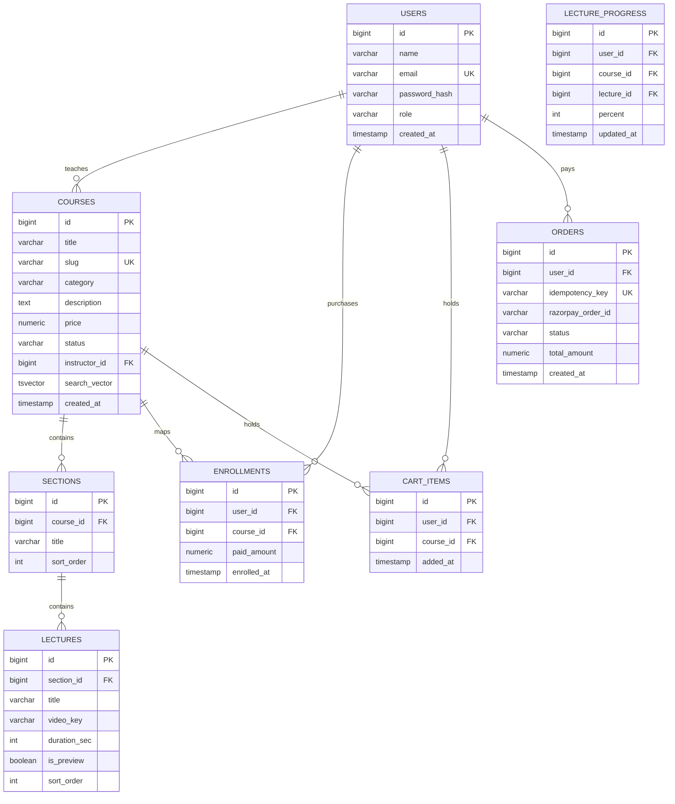

# EduFlow: Unified Product Requirements & System Design Manual (v1.0)

EduFlow is an optimized, high-fidelity **Udemy Clone Course Selling Platform** built to demonstrate elite system design patterns and resolve well-documented industry bottlenecks (N+1 queries, race conditions, progress write-throttling, and adaptive HLS video streaming).

---

## 1. System Design Architecture & Bottleneck Solutions

### P1: N+1 Query Elimination on Course Catalog
* **The Problem:** In a typical JPA setup, querying 100 courses fires 100 additional database calls to fetch the instructor name, reviews, and average ratings, throttling the database.
* **The Solution:** We implement **JPA DTO Projections** (`CourseListDTO`) using constructor expressions or interface mappings that perform a single database fetch using SQL `LEFT JOIN` groups. Full entities are never loaded for catalog listings.

### P2: Cart Purchase Race-Condition & Double Enrollment
* **The Problem:** Concurrently hitting checkout APIs (e.g. from the client success redirect and payment webhook simultaneously) can result in double-charging or duplicate enrollment records.
* **The Solution:** We enforce a `UNIQUE` index constraint on `orders(idempotency_key)` and utilize PostgreSQL **Pessimistic Write Locking** (`SELECT ... FOR UPDATE` via `LockModeType.PESSIMISTIC_WRITE`) when processing transactions. Webhook handlers are the single source of truth for finalizing enrollment.

### P3: Video Buffering & Adaptive Bitrate HLS Streaming
* **The Problem:** Storing and serving standard MP4 files results in high bandwidth consumption and buffering for users on slower networks.
* **The Solution:** Videos are transcoded asynchronously into **HLS (HTTP Live Streaming)** playlists (`.m3u8` index pointing to 10-second `.ts` chunks). Content is delivered securely via **AWS CloudFront CDN** using **Signed Cookies** to prevent link-sharing while ensuring seamless chunk authentication.

### P4: High-Write Progress Tracking Caching (Write-Back Policy)
* **The Problem:** Tracking student watch progress coordinates (fired every 10 seconds) creates a massive write load on PostgreSQL.
* **The Solution:** We cache progress updates in a Redis `HASH` and append modified user identifiers to a Redis Set (`user:progress:dirty`). A Spring Boot `@Scheduled` cron pops keys from this set every 5 minutes and runs a batch write-back execution to PostgreSQL.

### P5: Fast database Full-Text Search (FTS)
* **The Problem:** Elasticsearch clusters add significant infrastructure complexity and hosting fees.
* **The Solution:** We utilize PostgreSQL native Full-Text Search. A generated `tsvector` column updates automatically on title or description changes:
  ```sql
  ALTER TABLE courses ADD COLUMN search_vector tsvector 
  GENERATED ALWAYS AS (to_tsvector('english', coalesce(title,'') || ' ' || coalesce(description,''))) STORED;
  ```
  We create a **GIN index** over this generated column to achieve highly optimized fuzzy matches.

---

## 2. Core Database Schema & Constraints



### Unique Database Integrity Constraints:
* `uq_enrollments_user_course`: `UNIQUE(user_id, course_id)` on `enrollments` table.
* `uq_cart_items_user_course`: `UNIQUE(user_id, course_id)` on `cart_items` table.
* `uq_progress_user_course_lecture`: `UNIQUE(user_id, course_id, lecture_id)` on `lecture_progress` table.

---

## 3. Frontend Architecture & Color Mapping

### The Exact Udemy Color Token Guide:
We enforce the following hex color design definitions:
* **Brand Primary:** `#A435F0` (Udemy Purple). Used for primary call-to-actions, checkouts, and icons. Hover maps to `#8710D8`.
* **Brand Text/Neutral:** `#1C1D1F` (Dark Charcoal Off-Black). Used for main body text, navigation frames, and outline buttons. Hover maps to `#2D2F31`.
* **Border Trim:** `#D1D7DC` (Border Grey). Used for inputs, panel dividers, and grids.
* **Warm Accents:** `#B4690E` (Warm Gold). Used for star ratings and active review metrics.
* **Soft Neutral Background:** `#F7F9FA` (Off-White). Used for sub-sections, drawers, and headers.

### Navigation Behavior:
* **Global Headers:** A persistent search-catalog header (`Navbar.tsx`) is rendered on all routes.
* **Learn cinematic space (`/learn/[courseId]`):** The global navbar is hidden. It is replaced with a minimal `LearnNavbar.tsx` featuring a back button, active course title, radial progress percentages, and course sharing utilities.

---

## 4. Key Security & Token Storage Policies

1. **Access Token Storage:** Retained solely in JavaScript runtime memory (in-memory state) to protect against cross-site scripting (XSS) extraction.
2. **Refresh Token Storage:** Exchanged over HTTPS and stored as a secure, HTTP-only, SameSite=Strict cookie managed by Spring Boot.
3. **Google ID Token:** Verified once at `POST /api/auth/google`, matched with database email keys, and immediately discarded after issuing the application JWT.
4. **Middleware Protection (`middleware.ts`):**
   * Unauthenticated users attempting to access `/learn`, `/instructor`, `/admin`, `/my-courses`, or `/cart` are dynamically redirected to `/login` with target path parameters.
   * Authenticated users attempting to load `/login` or `/register` are bypassed back to the homepage `/`.

---

## 5. REST API Specifications

| Method | Endpoint | Auth Required | Description |
| :--- | :--- | :--- | :--- |
| **POST** | `/api/auth/register` | Public | Register standard student/instructor account. |
| **POST** | `/api/auth/login` | Public | Authenticate and return user info + JWT in memory. |
| **POST** | `/api/auth/google` | Public | Authenticate or Register via Google ID token. |
| **POST** | `/api/auth/refresh` | Public | Exchange refresh cookie for a new access token. |
| **GET** | `/api/courses` | Public | FTS search + category filter. |
| **GET** | `/api/courses/{slug}` | Public | Load course detail metrics and syllabus. |
| **POST** | `/api/courses` | Instructor | Create course draft. |
| **POST** | `/api/courses/{id}/video-presigned-url` | Instructor | Generate pre-signed URL to upload video directly. |
| **GET** | `/api/cart` | Student | List active user cart contents. |
| **POST** | `/api/cart` | Student | Add course item to user cart. |
| **DELETE**| `/api/cart/{courseId}` | Student | Remove course item from user cart. |
| **POST** | `/api/orders/checkout` | Student | Create idempotent Razorpay checkout order. |
| **POST** | `/api/orders/verify` | Student | Verify local signature check and enroll user. |
| **POST** | `/api/orders/webhook` | Public (Razorpay) | Verify webhook signature and enroll user. |
| **PUT** | `/api/progress/{courseId}/{lectureId}` | Enrolled | Update lecture watch progress coordinates in Redis. |
| **GET** | `/api/progress/{courseId}` | Enrolled | Load student progress map. |
| **GET** | `/api/enrollments/my-courses` | Enrolled | List student enrolled courses. |
| **GET** | `/api/enrollments/check/{courseId}` | Enrolled | Check active enrollment validation status. |
